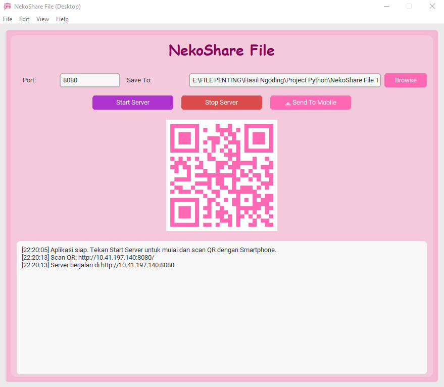

# NekoShare File (Desktop) Portable
NekoShare File Transfer is a file transfer application for Desktop PC that allows users to send and receive files.

## Features
- Portable No Installation
- PC to PC File Transfer
- File Transfer Mobile to PC
- Scan QR Code
- Website Based Client
- Tailwind CSS for styling

## Getting Started

### Requirement
- Python 3.10
- pip

### Installation
1. **Install the dependencies:**

```bash
pip install -r requirements.txt
```

2. **Run the code:**

```bash
python nekoshare-portable.py
```

### Development
1. **Build for Windows .exe:**

```bash
pyinstaller --onefile --windowed --icon="assets/icon.ico" --add-data "assets;assets" --name "NekoShare File (Desktop) Portable Win x64" nekoshare-portable.py
```

2. **Package Directory Structure .deb:**

```
Linux/nekoshare-portable-v1.0.0-x64/
├── DEBIAN/
│   └── control
└── usr/
    ├── bin/
    │   └── nekoshare
    └── share/
        └── applications/
        │   └── nekoshare.desktop
        └── pixmaps/
            └── nekoshare.png
```
Build the package on Linux Terminal
```bash
dpkg-deb --build nekoshare-portable-v1.0.0-x64
```


## Screenshot


## Styling
This template comes with [Tailwind CSS](https://tailwindcss.com/) already configured for a simple default starting experience. You can use whatever CSS framework you prefer.

## Developer
This application was developed by [Rizko Imsar](https://github.com/rizko77) with the aim of making it easier to send files between devices.

## Lisensi
This application is **open-source** and released under the [MIT License](LICENSE.txt).
